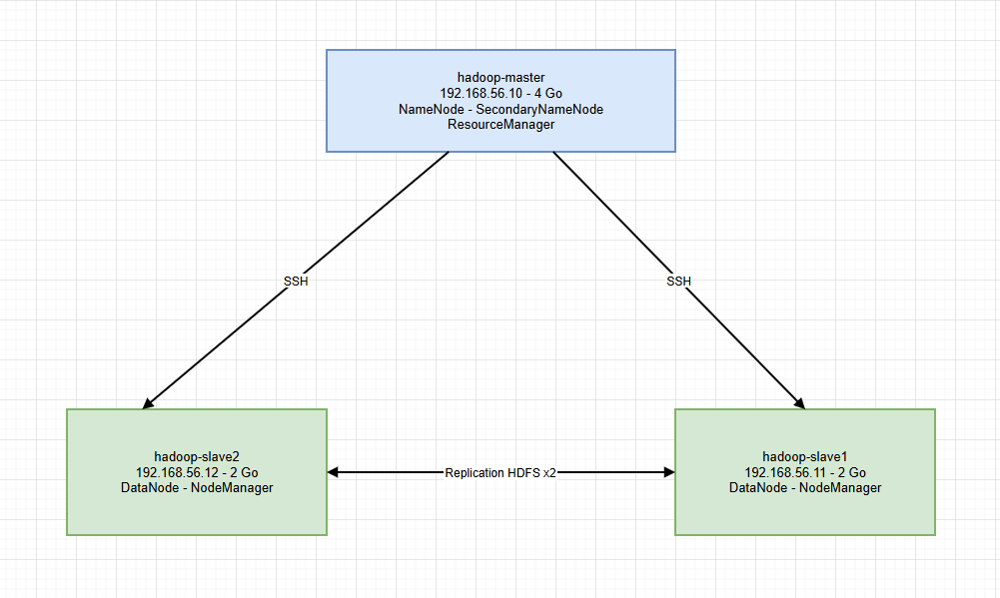
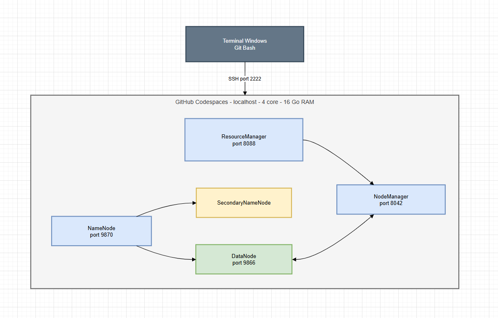
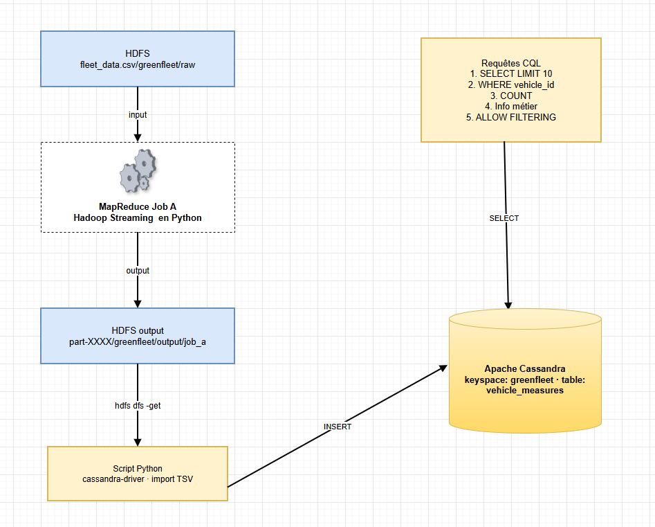

# Atelier Écosystème Hadoop

Objectif : Mettre en place une plateforme Hadoop pour stocker et analyser les données télémétriques issues des véhicules électriques pour la startup Greenfleet. Ces données seront par la suite chargées (les résultats d'un job au choix) dans Apache Cassandra et les exploiter avec des requêtes CQL,

## Ressources pour les étudiants

## Contenu du dossier

```bash
hadoop_resources/
│
├── README.md                          ← Ce fichier
│
├── vagrant/
│   └── Vagrantfile                    ← Création automatisée des 3 VMs
│
├── config/
│   ├── core-site.xml                  ← Config générale Hadoop (adresse NameNode)
│   ├── hdfs-site.xml                  ← Config HDFS (réplication, répertoires)
│   ├── yarn-site.xml                  ← Config YARN (ResourceManager, mémoire)
│   ├── mapred-site.xml                ← Config MapReduce (framework, mémoire)
│   ├── hadoop-env.sh                  ← Variables Java + utilisateurs démons
│   ├── workers                        ← Liste des nœuds esclaves
│   └── hadoop_bashrc.sh               ← Variables d'env à ajouter au .bashrc
│
├── datasets/
│   ├── generate_web_logs.sh           ← Génère web_logs.csv (Partie A)
│   └── generate_greenfleet.sh         ← Génère fleet_data.csv (Partie B - Projet)
│
└── scripts/
    ├── mapreduce/
    │   ├── mapper_status.py           ← Partie A : mapper codes HTTP
    │   ├── mapper_pages.py            ← Partie A : mapper pages visitées
    │   ├── mapper_duration.py         ← Partie A : mapper durée par page
    │   ├── reducer_count.py           ← Reducer générique de comptage
    │   ├── reducer_avg.py             ← Reducer de calcul de moyenne
    │   ├── reducer_sum.py             ← Reducer de somme
    │   ├── mapper_vehicle_count.py    ← Projet : mesures par véhicule (Job A)
    │   ├── mapper_fleet_status.py     ← Projet : répartition par statut (Job B)
    │   ├── mapper_speed.py            ← Projet : vitesse moyenne (Job C)
    │   ├── mapper_low_battery.py      ← Projet : alertes batterie <15% (Job D)
    │   ├── mapper_daily_distance.py   ← Projet : distance/jour/véhicule (Job E)
    │   ├── run_jobs_partA.sh          ← Lance tous les jobs Partie A
    │   └── run_jobs_projet.sh         ← Lance tous les jobs Projet
    │
    └── admin/
        ├── health_check.sh            ← Vérification santé du cluster
        ├── deploy_node.sh             ← Déploiement automatisé d'un nouveau nœud
        └── setup_ssh.sh               ← Configuration SSH sans mot de passe
```

### Partie A — Exercices guidés (logs web)

Analyse de logs web : codes HTTP, pages visitées, durée de réponse.



### Partie B — Projet individuel (GreenFleet)

Analyse de données télémétriques de flotte de véhicules électriques.



### Partie C — Intégration Cassandra

Stockage des résultats MapReduce dans Apache Cassandra pour requêtes rapides.



## Note sur l'environnement

Cet atelier a été réalisé sur **GitHub Codespaces** (mode pseudo-distribué) en lieu et place de 3 VMs VirtualBox. Adaptations appliquées :

| Paramètre        | Doc (3 VMs)     | Codespaces (1 machine)                      |
| ---------------- | --------------- | ------------------------------------------- |
| Adresse NameNode | `hadoop-master` | `localhost`                                 |
| Port SSH         | 22              | 2222                                        |
| Réplication HDFS | 2               | 1                                           |
| Commande yarn    | `yarn`          | `$HADOOP_HOME/bin/yarn`                     |
| cqlsh            | `cqlsh`         | `/home/codespace/.python/current/bin/cqlsh` |

## Guide de démarrage rapide

### 1. Créer les VMs (ou ouvrir Codespaces)

```bash
cd vagrant/
vagrant up
```

### 2. Configurer SSH

```bash
chmod +x scripts/admin/setup_ssh.sh
./scripts/admin/setup_ssh.sh
```

### 3. Installer Hadoop

Copiez les fichiers de config dans `$HADOOP_HOME/etc/hadoop/` :

```bash
cp config/core-site.xml $HADOOP_HOME/etc/hadoop/
cp config/hdfs-site.xml $HADOOP_HOME/etc/hadoop/
cp config/yarn-site.xml $HADOOP_HOME/etc/hadoop/
cp config/mapred-site.xml $HADOOP_HOME/etc/hadoop/
cp config/hadoop-env.sh $HADOOP_HOME/etc/hadoop/
cp config/workers $HADOOP_HOME/etc/hadoop/
```

Ajoutez les variables d'environnement :

```bash
cat config/hadoop_bashrc.sh >> ~/.bashrc
source ~/.bashrc
```

### 4. Démarrer le cluster

```bash
hdfs namenode -format
start-dfs.sh
start-yarn.sh
jps  # NameNode, DataNode, SecondaryNameNode, ResourceManager, NodeManager
```

### 5. Générer les datasets

**Partie A :**

```bash
chmod +x datasets/generate_web_logs.sh
./datasets/generate_web_logs.sh
hdfs dfs -mkdir -p /data/input
hdfs dfs -put web_logs.csv /data/input/
```

**Partie B :**

```bash
chmod +x datasets/generate_greenfleet.sh
./datasets/generate_greenfleet.sh
hdfs dfs -mkdir -p /greenfleet/raw /greenfleet/output
hdfs dfs -put fleet_data.csv /greenfleet/raw/
```

### 6. Lancer les jobs MapReduce

**Tester en local :**

```bash
cat fleet_data.csv | python3 scripts/mapreduce/mapper_vehicle_count.py \
  | sort | python3 scripts/mapreduce/reducer_count.py
```

**Lancer sur le cluster :**

```bash
hadoop jar $HADOOP_HOME/share/hadoop/tools/lib/hadoop-streaming-3.3.6.jar \
  -input /greenfleet/raw/fleet_data.csv \
  -output /greenfleet/output/job_a \
  -mapper "python3 mapper_vehicle_count.py" \
  -reducer "python3 reducer_count.py" \
  -file scripts/mapreduce/mapper_vehicle_count.py \
  -file scripts/mapreduce/reducer_count.py
```

### 7. Vérifier la santé du cluster

```bash
chmod +x scripts/admin/health_check.sh
./scripts/admin/health_check.sh
```

---

## Intégration Cassandra (Partie C)

### Installation

```bash
echo "deb https://debian.cassandra.apache.org 41x main" | \
  sudo tee /etc/apt/sources.list.d/cassandra.sources.list
curl https://downloads.apache.org/cassandra/KEYS | sudo apt-key add -
sudo apt update && sudo apt install cassandra -y
sudo service cassandra start
sleep 40
nodetool status  # UN = Up/Normal
```

### Installation du driver Python

```bash
/home/codespace/.python/current/bin/pip install cassandra-driver
```

### Import des données

```bash
hdfs dfs -get /greenfleet/output/job_a/part-00000 results_job_a.tsv
python3 cassandra/import_cassandra.py
# 200 lignes insérées dans Cassandra
```

### Requêtes CQL

```bash
/home/codespace/.python/current/bin/cqlsh
```

```sql
USE greenfleet;
SELECT * FROM vehicle_measures LIMIT 10;
SELECT * FROM vehicle_measures WHERE vehicle_id = 'VH-001';
SELECT COUNT(*) FROM vehicle_measures;
SELECT * FROM vehicle_measures WHERE measure_count > 250 ALLOW FILTERING;
SELECT * FROM vehicle_measures WHERE measure_count < 210 ALLOW FILTERING;
```

---

## 📋 Correspondance Fichiers ↔ Tâches du module

| Tâche                          | Fichiers concernés                                    |
| ------------------------------ | ----------------------------------------------------- |
| T1 — Analyse des besoins       | generate_greenfleet.sh                                |
| T2 — Configuration cluster     | Vagrantfile, config/*, setup_ssh.sh                   |
| T3 — Installation composants   | config/*, hadoop_bashrc.sh                            |
| T4 — Gestion stockage HDFS     | generate_web_logs.sh, generate_greenfleet.sh          |
| T5 — Jobs MapReduce            | scripts/mapreduce/*.py, run_jobs_*.sh                 |
| T6 — Surveillance/optimisation | health_check.sh                                       |
| T7 — Tests et démo             | health_check.sh, deploy_node.sh                       |
| Cassandra                      | cassandra/import_cassandra.py, cassandra/requetes.cql |

---

## Notes importantes

- **Rendre les scripts exécutables** avant de les lancer : `chmod +x script.sh`
- **Les fichiers de config** sont commentés — lisez les descriptions XML
- **Tester en local** avant de lancer sur le cluster
- **Hadoop Streaming 3.3.6** : vérifiez que le JAR existe dans `$HADOOP_HOME/share/hadoop/tools/lib/hadoop-streaming-3.3.6.jar`
- **Cassandra** : toujours vérifier avec `nodetool status` avant de lancer `cqlsh`
- **Sur Codespaces** : SSH et Cassandra peuvent s'arrêter — relancer avec `sudo service ssh start` et `sudo service cassandra start`
  